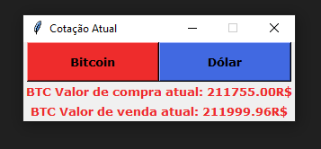

# Cotação de Moedas (Bitcoin e Dólar) para R$ em Tempo Real! (Desktop)
### Autor: Luan Fellipe (allen08)
O programa pode ser usado tanto individualmente (como APIs) ou na Interface Grafica (Desenvolvida no Python Tkinter)

## [*] Requisitos:
	- Python 3.4 ou Superior
## [*] Execução:

